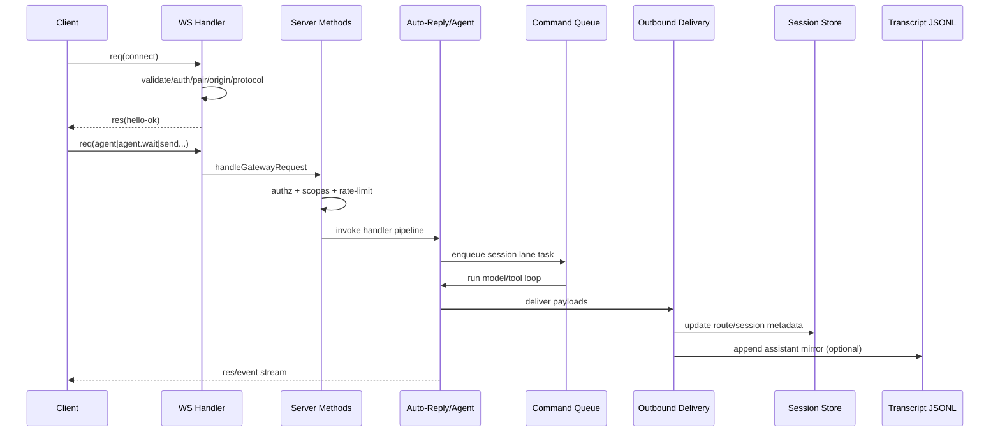
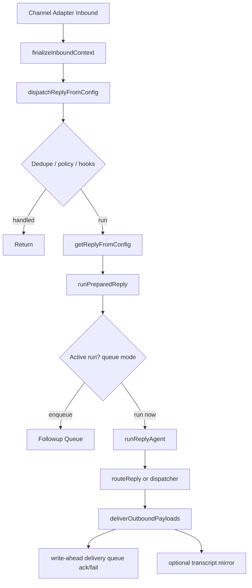

# OpenClaw Runtime Spec (Reimplementation-Oriented)

## 0) Scope and Design Targets

This spec covers:

1. **Ingestion**
2. **Sanitization**
3. **Queuing**
4. **Routing**
5. **Processing**
6. **Workflows**
7. **Memories (persistent history + semantic memory)**

It is based on concrete behavior in core paths like:

- `src/gateway/server/ws-connection/message-handler.ts`
- `src/gateway/server-methods.ts`
- `src/auto-reply/reply/dispatch-from-config.ts`
- `src/auto-reply/reply/get-reply.ts`
- `src/auto-reply/reply/get-reply-run.ts`
- `src/auto-reply/reply/agent-runner.ts`
- `src/process/command-queue.ts`
- `src/routing/resolve-route.ts`
- `src/config/sessions/store.ts`
- `src/config/sessions/transcript.ts`
- `src/infra/outbound/deliver.ts`
- `src/infra/outbound/delivery-queue-storage.ts`
- `extensions/memory-core/src/memory/manager.ts`
- `extensions/memory-core/src/memory/manager-search.ts`

Companion docs (TypeScript-facing):

- `spec.contracts.md` — canonical interfaces, envelopes, and persistence contracts
- `spec.algorithms.md` — TypeScript-style pseudocode for critical runtime/state-machine paths
- `spec.conformance.md` — executable conformance test manifest (IDs, fixtures, expected outcomes)

---

## 1) System Model

OpenClaw is a pipeline of decoupled components:

- **Ingress Plane**: WebSocket/HTTP/channel adapters
- **Control Plane**: authz, method dispatch, rate limits
- **Run Plane**: routing + per-session/global queues + agent runner
- **Delivery Plane**: outbound adapters + write-ahead delivery queue
- **Memory Plane**:
  - **History memory** (session metadata + JSONL transcripts)
  - **Semantic memory** (`memory-core`: markdown + SQLite hybrid index)

---

## 2) Ingestion Spec

## 2.1 WebSocket Gateway Ingestion

### 2.1.1 Handshake contract (first frame must be connect)

- Incoming bytes -> JSON parse
- Validate as protocol request frame
- First request MUST be:
  - `type = "req"`
  - `method = "connect"`
  - `params` valid against protocol validator (`validateConnectParams`)

If invalid:
- respond with error (when possible)
- close connection with policy/protocol code

### 2.1.2 Pre-auth hard limits

Before handshake completes:
- Reject if payload > `MAX_PREAUTH_PAYLOAD_BYTES`
- Close with payload-too-large

### 2.1.3 Handshake checks (in order)

1. Protocol compatibility (`minProtocol/maxProtocol`)
2. Role parsing and validity
3. Origin checks (for browser/operator/webchat contexts)
4. Authentication (token/password/device/bootstrap/device-token paths)
5. Pairing policy checks and potential pairing-required rejection
6. Scope constraints (default deny; clear unbound scopes)
7. Optional device metadata pin checks
8. Node-specific reconciliation (for role=node)
9. Presence registration
10. Send `hello-ok` with features/snapshot/policy/auth tokens

After connected, only regular request frames are accepted.

---

## 2.2 Gateway Method Dispatch

For each post-connect request:

1. Role/scope authorization (`authorizeGatewayMethod`)
2. Control-plane write rate limiting for mutating methods
3. Handler lookup from merged handler registry
4. Execute handler inside plugin runtime gateway request scope
5. Respond via unified `respond(ok,payload,error)`

---

## 2.3 Channel/Provider Ingestion (auto-reply path)

Channel adapter creates context (`MsgContext`), then:

- `dispatchInboundMessage` -> `finalizeInboundContext` -> `dispatchReplyFromConfig`
- Hook, policy, routing, and agent execution happen after this normalization boundary.

---

## 3) Sanitization Spec

Sanitization is layered and mandatory.

## 3.1 Transport-level sanitization

- Frame shape validation (AJV validators)
- Protocol/version bounds
- Preauth payload size guards
- Origin header policy

## 3.2 Identity/auth sanitization

- Normalize role/scopes
- Normalize device metadata/public keys
- Enforce pairing and approved access boundaries
- Clear scopes when not identity-bound

## 3.3 Message context sanitization (`finalizeInboundContext`)

Applied before processing:

- Normalize newlines in text fields
- Remove/sanitize inbound system tags
- Normalize `Body`, `RawBody`, `CommandBody`, `BodyForAgent`, `BodyForCommands`
- Normalize `ChatType`
- Normalize/derive conversation label
- Force `CommandAuthorized` to explicit boolean (default false)
- Align media typing:
  - if media exists, guarantee `MediaType` and `MediaTypes[]`
  - fill missing types with default `application/octet-stream`

This is the canonical boundary: downstream code consumes finalized context only.

## 3.4 Outbound sanitization

Before send:

- Normalize reply payload
- Channel-specific `sanitizeText` / `normalizePayload`
- Suppress reasoning payloads on channels that do not support a reasoning lane
- Drop empty/no-content payloads

---

## 4) Queuing Spec

There are **two distinct queueing systems**:

1. **Execution lanes** (global process command queue)
2. **Follow-up message queue** (busy-run buffering per logical session)

## 4.1 Execution lane queue (`CommandQueue`)

### State model per lane
- FIFO queue of tasks
- Active task set
- `maxConcurrent` (default 1)
- generation counter
- draining flag

### Behavior
- `enqueueCommandInLane(lane, task)` returns Promise
- Lane pump starts if idle
- Executes while `active < maxConcurrent`
- Resolves/rejects task promise on completion
- Supports:
  - `clearCommandLane` (reject queued tasks with `CommandLaneClearedError`)
  - `markGatewayDraining` (reject new enqueues with `GatewayDrainingError`)
  - `setCommandLaneConcurrency`
  - reset APIs for restart/test resilience

### Concurrency contract
- **Per-session serialization** is achieved by mapping session to `session:<key>` lane.
- Global caps are implemented using another lane (e.g., main) in runner logic.

## 4.2 Follow-up queue (message backlog while run active)

Per queue key:
- mode (`steer`, `followup`, `collect`, `steer-backlog`, `interrupt`, `queue`)
- debounce
- cap
- drop policy (`old`, `new`, `summarize`)
- dedupe (message-id / prompt / none)

Drain loop:
- debounced
- mode-specific handling:
  - **collect**: aggregate queued items into one synthetic prompt
  - **followup/steer-backlog**: run queued prompts serially
  - **steer**: route into active run when possible; else queue
- preserves origin routing metadata with each queued item

---

## 5) Routing Spec

Routing has two layers:

1. **Agent/session routing for inbound work**
2. **Outbound channel routing for replies**

## 5.1 Inbound agent route resolution (`resolveAgentRoute`)

Inputs:
- channel, accountId, peer, parentPeer, guildId, teamId, role IDs
- config bindings + defaults

Evaluation tiers (first match wins):
1. `binding.peer`
2. `binding.peer.parent`
3. `binding.peer.wildcard`
4. `binding.guild+roles`
5. `binding.guild`
6. `binding.team`
7. `binding.account`
8. `binding.channel`
9. default agent

Outputs:
- `agentId`
- `sessionKey` (derived from agent/channel/account/peer + dm scope)
- `mainSessionKey`
- `lastRoutePolicy` (main vs session)
- `matchedBy`

Caches are used for binding evaluation and resolved routes.

## 5.2 Outbound route-to-origin behavior (`routeReply`)

Given payload + explicit target channel/to:
- normalize channel, locate plugin
- normalize payload and apply response prefix
- skip empty payloads
- resolve thread/reply transport
- call `deliverOutboundPayloads`
- optional transcript mirroring tied to sessionKey

Webchat/internal channel is treated specially (not generic-routable).

---

## 6) Processing Spec (agent turn lifecycle)

High-level stack:

1. `dispatchReplyFromConfig`
2. `getReplyFromConfig`
3. `runPreparedReply`
4. `runReplyAgent`
5. `runAgentTurnWithFallback` (execution + retry/fallback)

## 6.1 Pre-run orchestration

- dedupe check for repeated inbound
- load session metadata entry if available
- hooks:
  - plugin-bound claim handling
  - `message_received`
  - internal message hook bridge
  - `before_dispatch`
- send policy gate (can deny sending)
- ACP dispatch paths / abort shortcuts when relevant

## 6.2 Context and directives

`getReplyFromConfig`:
- resolve agent id from session key
- resolve model defaults + overrides (heartbeat/session/channel)
- ensure workspace
- apply media understanding / link understanding
- initialize/resolve session state
- apply directives and inline commands
- run `before_agent_reply` hook
- stage media for sandbox as needed

## 6.3 Run preparation (`runPreparedReply`)

- build system/user context prefixes
- group intro/context injection
- strip/normalize command-only bodies
- enforce xhigh-thinking compatibility
- resolve queue settings for this message
- steer/interrupt/followup logic based on active run state
- prepare followup run descriptor (full execution contract)

## 6.4 Run execution (`runReplyAgent`)

- run-start typing signaling
- optional preflight compaction
- optional pre-compaction memory flush
- execute model/tool loop with fallback handling
- stream block replies/tool results as callbacks
- apply reply-to mode filters and channel constraints
- normalize payloads, reminder guard, usage append, verbose notices
- schedule next followup dequeue

State persistence during/after run:
- usage, token accounting, provider/model used
- fallback state transitions
- compaction counters
- session touch/update timestamps

---

## 7) Workflow Specs (End-to-End)

## 7.1 WS `agent` request -> response

## 7.2 Channel inbound message -> routed reply

## 7.3 History write invariant (critical)

All transcript appends MUST go through `SessionManager.appendMessage` semantics (not ad hoc file writes), preserving parent/message chain integrity for history + compaction correctness.

---

## 8) Persistent Memory Spec

## 8.1 Layer A: Session history memory (authoritative)

### 8.1.1 Storage
- `sessions.json` = session metadata map keyed by normalized session key
- `<sessionId>.jsonl` = append-only transcript records

### 8.1.2 Session metadata operations
- Locking with queue + file lock (`updateSessionStore`)
- Re-read inside lock before mutate (avoid clobbering)
- Atomic file write (`writeTextAtomic`)
- Maintenance:
  - prune stale entries
  - cap entry count
  - archive removed transcripts
  - disk budget enforcement
  - optional warn-only mode

### 8.1.3 Transcript operations
- Resolve canonical transcript file path
- Ensure session header exists
- Append user/assistant messages via SessionManager
- Emit transcript update events
- Mirror outbound assistant text/media summaries into transcript (optional)

## 8.2 Layer B: Semantic memory (`memory-core` plugin)

### 8.2.1 Sources
- markdown memories (`MEMORY.md`, daily memory files, extra paths)
- optionally session-derived content depending on config/sync

### 8.2.2 Index backend
SQLite with tables/concepts:
- chunks/files metadata
- vector table (`chunks_vec`, sqlite-vec when available)
- FTS table (`chunks_fts`)
- embedding cache

### 8.2.3 Sync model
Triggers:
- file watcher changes
- session listener updates
- periodic sync timer
- on-search/on-session-start policies

Robustness:
- readonly-db recovery (reopen DB, re-run sync)
- provider initialization/fallback handling
- optional FTS-only mode when embeddings unavailable

### 8.2.4 Retrieval algorithm (`memory_search`)
1. Normalize/clean query
2. Optional keyword extraction
3. Vector search (if embeddings available)
4. Keyword/FTS search
5. Hybrid merge:
   - vectorWeight/textWeight
   - temporal decay (recency)
   - MMR rerank (diversity)
6. Threshold + top-k selection

`memory_get` is direct file/path read with optional line range.

---

## 9) Sync vs Async Contract Matrix

- **Sync/inline (must complete before next step):**
  - frame validation
  - authorization checks
  - route resolution
  - queue enqueue decision
  - session store locked mutation transaction
- **Async but awaited in flow:**
  - handler execution
  - agent run
  - outbound delivery send call
  - transcript append during mirror
- **Async fire-and-forget (non-blocking side effects):**
  - some plugin/internal hooks
  - health refresh/probes
  - warm-up sync triggers for memory
- **Background loops:**
  - command lane pumps
  - followup queue drains
  - delivery recovery scans
  - memory file/session watchers

---

## 10) Minimal Reimplementation Interfaces

If you’re rebuilding in another language, define these interfaces first:

- `IngressAdapter` (WS/HTTP/channel)
- `AuthPolicyEngine` (role/scope/pairing/origin)
- `RequestDispatcher` (method -> handler)
- `RouteResolver` (bindings -> agent/session)
- `LaneQueue` (per-lane FIFO + concurrency)
- `FollowupQueue` (mode/debounce/cap/drop/dedupe)
- `AgentRunner` (single-turn execution + fallback)
- `OutboundAdapterRegistry` (channel sendText/sendMedia/sendPayload)
- `DeliveryWAL` (enqueue/ack/fail/recover)
- `SessionStore` (locked mutate + maintenance)
- `TranscriptStore` (SessionManager-compatible append semantics)
- `MemoryIndex` (sync + hybrid search + provider fallback)

---

## 11) How to Use This Spec for Non-TS Ports

Even if the target implementation language is not TypeScript, keep this document set as the canonical behavior source:

1. Treat `spec.contracts.md` TypeScript interfaces as **wire/storage/runtime contracts**.
2. Treat `spec.algorithms.md` pseudocode as **behavioral reference**, not syntax reference.
3. Treat `spec.conformance.md` as the **compatibility gate** for behavior parity.
4. Preserve ordering, invariants, and error semantics first; optimize internals second.

Porting sequence recommendation:

1. Protocol + ingress validator layer
2. Route resolver + queue state machines
3. Session store + transcript append invariants
4. Agent runner + fallback/compaction loop
5. Outbound delivery WAL and recovery
6. Memory index and hybrid retrieval
